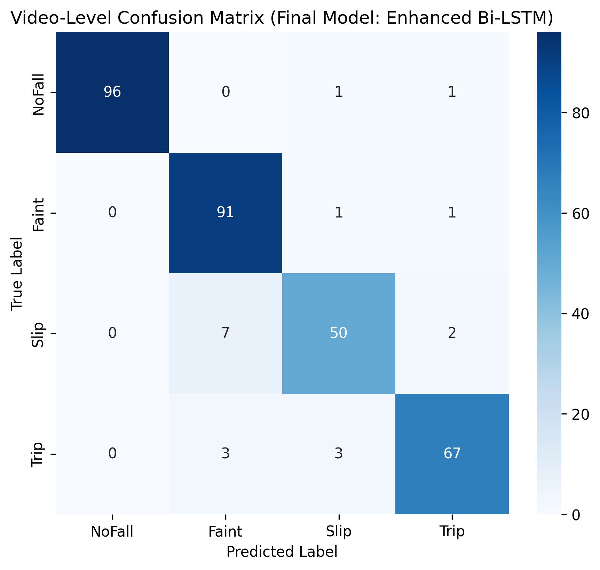

# 🏃‍♂️ Human Fall Recognition and Classification System

## 📌 Project Overview
This repository contains the source code and research for an advanced, real-time Human Fall Recognition system. The system utilizes a hybrid deep learning architecture designed to analyze video feeds, extract dynamic human skeletal points, and classify temporal movement sequences to accurately detect falls in real-time.

**👉 [CLICK HERE TO VIEW THE LIVE APPLICATION DEMO](https://sh40l-fall-recognition-and-classification-system.hf.space/)**

---

## 🧠 Methodology and Architecture
This project processes video data through a robust two-step pipeline:

### 1. Spatial Feature Extraction (YOLOv8 Pose)
The system first utilizes the **YOLOv8 Pose** model to identify subjects and extract highly precise skeletal keypoints from every single frame of the video. This ensures the model focuses entirely on human movement dynamics while ignoring environmental background noise.

### 2. Sequential Classification (Bi-LSTM)
Because a fall is an action that happens *over time*, static images are not enough. The extracted temporal sequences of skeletal coordinates are fed into a **Bidirectional Long Short-Term Memory (Bi-LSTM)** neural network. This allows the system to understand the context of the movement both forwards and backwards in time, accurately classifying the sequence as a "Fall" or "Normal Activity."

---

## 📂 Repository Structure
*Note: Due to large file constraints, the raw video dataset (`GUB-STFN-Fall-Dataset`) and the compiled `.keras` weights are hosted securely on Hugging Face alongside the live deployment.*

* **`notebooks/`**: Contains the Jupyter/Colab notebooks detailing the Data Preprocessing, YOLOv8 Pose training, and Bi-LSTM model training phases.
* **`Streamlit_App/`**: Contains the complete source code (`app.py`, `requirements.txt`, `Dockerfile`) for the cloud-deployed web application.
* **`results/`**: Contains the exported visualization graphs, model evaluation metrics, and confusion matrices.
* **`logs/`**: Contains the historical training data and epoch progression records.

---

## 📊 Model Evaluation & Results
**(You can replace the links below with the actual names of the images inside your `results` folder!)**

The hybrid YOLOv8 + Bi-LSTM architecture achieved high accuracy during validation. Below are the training metrics and the final confusion matrix showcasing the model's reliability in distinguishing between falls and non-falls:

* **Training Accuracy & Loss:**
  

* **Confusion Matrix:**
  

---

## 🚀 Cloud Deployment
The final, production-ready application is containerized using Docker and deployed entirely on **Hugging Face Spaces**. 

It features an interactive web interface built with **Streamlit**, allowing users to select sample videos and watch the AI process the skeletal tracking and classification logic directly in their browser.
